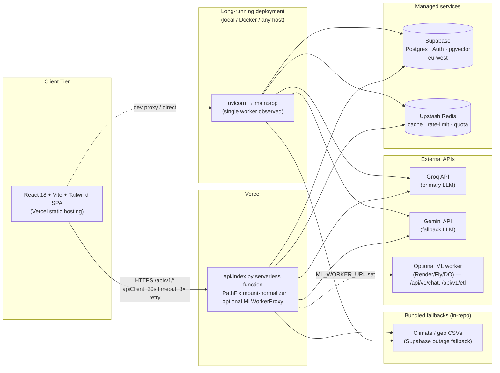
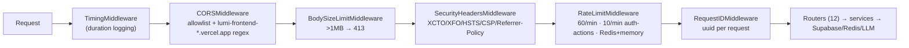
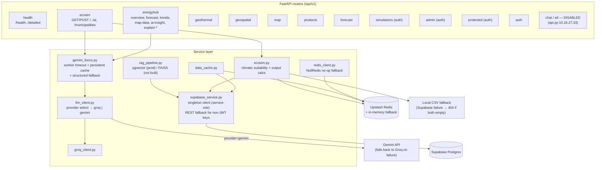

# System Architecture — LUMI

**Date:** September 5, 2026
**Basis:** Codebase audit + live runtime inspection (OpenAPI: 70 mounted endpoints across 12 routers)

---

## 1. Overview

LUMI is a three-tier system: a **React/Vite SPA** (Vercel), a **FastAPI backend** deployable as a long-running server *or* a Vercel serverless function, and managed services — **Supabase** (Postgres + Auth + pgvector RAG) and **Upstash Redis** (cache, rate limiting, quotas). AI features are served by **Groq** (primary) and **Gemini** (fallback-capable), with an optional external **ML worker** for heavy endpoints.

## 2. Deployment Topology



**Dual-mode backend:** `api/index.py` (serverless wrapper) sets `RAG_BACKEND=pgvector`, `LLM_PROVIDER=groq`, `EMBEDDING_PROVIDER=huggingface-inference` as env defaults, wraps `main.app` in `_PathFix` (strips `/api/index[.py]` mount prefix, clears `root_path`), and conditionally adds `MLWorkerProxyMiddleware` when `ML_WORKER_URL` is set. The same `main:app` runs under uvicorn elsewhere.

## 3. Request Pipeline (middleware order)

Outermost → innermost as registered in `main.py:56-70`:



## 4. Component & Data Flow



## 5. Authentication Sequence

```mermaid
sequenceDiagram
    participant U as User (SPA)
    participant API as FastAPI
    participant SA as Supabase Auth
    participant DB as Supabase DB — service-role
    participant R as Redis

    U->>API: Bearer <supabase JWT>
    API->>SA: auth.get_user(token)   [required paths]
    SA-->>API: user object or error → 401
    API->>DB: user_roles.role / profiles.is_active
    Note over API,DB: role → cache 300s; active → cache 60s
    API->>R: cache_get lumi:auth:*
    API-->>U: 200 + claims {sub,email,role,plan}

    Note over API: Optional-auth read paths verify the JWT<br/>LOCALLY with SUPABASE_JWT_SECRET (no Supabase round-trip),<br/>then check cached role/status.
```

Observed behavior: `get_current_user`/`get_verified_user` verify via `auth.get_user` (server-side). `get_verified_user_optional` uses local JWT verify (`_get_local_user`) → cached role/status — used on read-only paths.

## 6. Frontend

| Aspect | Implementation |
|---|---|
| Framework | React 18 + Vite + Tailwind; React Router (hash paths) |
| API client | `apiClient.js` — `fetch` + 30s `AbortController` timeout, ≤3 retries, 500ms exponential backoff, retries 5xx only (429 respected), `X-Request-Id` |
| Supabase | `supabaseClient` — publishable anon key (fallback hardcoded in `env.js`) |
| API base | dev: `/api/v1` (proxy); prod fallback: `https://lumi-backend-ten.vercel.app` |
| **Gap** | `ChatPage.jsx` exists but is **not in `AppRoutes.jsx`**; `apiClient` chat methods target the disabled `/api/v1/chat` router |

## 7. Disabled / Dormant Surface

| Component | State |
|---|---|
| `/api/v1/chat` router | Commented out — `api.py:10,27` (heavy RAG chat deferred) |
| `/api/v1/etl` router | Commented out — `api.py:16,33` (long-running) |
| `/api/v1/example` items router | Commented out |
| `ChatPage.jsx` frontend route | Not registered in `AppRoutes.jsx` |
| FAISS RAG backend | Code present; startup uses `pgvector` — FAISS index not built |
| NASA POWER ingestion | ETL-script only; **not called at runtime** |

## 8. Failure Boundaries (verified — see failure-recovery-results.md)

| Dependency fails → | Behavior |
|---|---|
| Supabase | `/health/detailed` → `degraded`; EcoSim falls back to CSV then clean 404 |
| Redis | NullRedis no-op cache; in-memory rate-limit/quota fallback |
| Groq+Gemini | EcoSim AI → structured fallback dict; endpoint still 200 |
| Gemini only | Automatic Groq fallback (verified live, 1.68s) |
| ML worker | 503 for proxied paths only; rest of API unaffected |
| Oversized body / bad JSON | 413 / 422 before routing |

*End of System Architecture*
